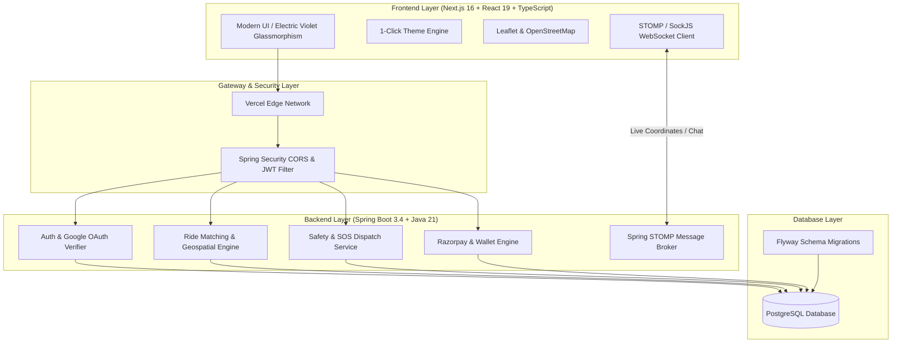

# Commuto

**Ride Together, Save Together** — a full-stack, real-time carpooling and smart ride-sharing platform built with **Next.js 16**, **React 19**, **Spring Boot 3.4**, **Java 21**, **PostgreSQL 16** & **STOMP WebSockets**.


[](https://commuto-iota.vercel.app/)
[](https://github.com/ananyajain327/Commuto/actions)

---

## 🚀 Live Demo

Try it live: **[https://commuto-iota.vercel.app/](https://commuto-iota.vercel.app/)**

---

## 📖 About

**Commuto** is a full-featured web application that connects **drivers** and **passengers** on one unified ride-sharing platform. Drivers can post trips with available seats, routes, and custom fares, while passengers can search, filter, and book rides easily.

The platform is designed to make daily commuting affordable, reduce carbon footprint, and ensure passenger security through verified profiles, emergency SOS broadcasts, and dedicated safety preferences.

---

## ✨ Features

- **User Authentication & Authorization**: Secure JWT registration, login, and cryptographically verified **Google OAuth 2.0** login with role-based access control (`PASSENGER`, `DRIVER`, `ADMIN`).
- **Post & Search Rides**: Drivers can publish scheduled trips with custom departure timings, seat quotas, and prices. Passengers can search rides by origin, destination, and date.
- **Custom Ride Requests**: Passengers can broadcast on-demand pickup/drop requests with custom budgets to all drivers.
- **Real-Time Tracking & Interactive Map**: Live route visualization, pickup points, and driver coordinates using OpenStreetMap and Leaflet.
- **Safety Center & SOS Alert System**: Emergency contact management and 1-click SOS panic trigger that captures live GPS coordinates and broadcasts alerts to safety contacts.
- **Women-Only Commute Mode**: Dedicated filter allowing women drivers and passengers to travel exclusively with verified women.
- **In-App Digital Wallet & Payments**: Integrated balance management with Razorpay payment checkout for instant top-ups and fare settlement.
- **Live Ride Chatrooms**: Real-time bi-directional messaging between driver and passengers powered by Spring STOMP WebSockets.
- **Driver KYC Verification**: License and vehicle document upload with admin verification approval workflow.
- **Mutual Rating & Review System**: 5-star ratings and feedback system to build trust in the commuter community.
- **Modern UI & 1-Click Dark Mode**: Glassmorphism design system featuring an **Electric Violet & Neon Obsidian** palette with a 1-click theme switcher.

---

## 🛠 Tech Stack

| Layer | Technologies |
| :--- | :--- |
| **Frontend** | Next.js 16 (App Router), React 19, TypeScript, Tailwind CSS v4, Leaflet Maps, SockJS & STOMP Client |
| **Backend** | Spring Boot 3.4, Java 21, Spring Security 6, Spring Data JPA, Spring WebSocket (STOMP) |
| **Database & Migration** | PostgreSQL 16, Flyway DB (automated migrations v1–v7), H2 Database (Testing) |
| **Authentication & Payments** | Google API Client (`GoogleIdTokenVerifier`), JJWT (HMAC-SHA256), Razorpay Java SDK |
| **DevOps & Hosting** | Vercel (Frontend), Docker & Docker Compose, GitHub Actions (CI/CD Pipeline) |

---

## 🏗 Architecture



---

## ⚡ Getting Started

### Prerequisites
- **Node.js** 20+ / 22+ & **npm**
- **Java Development Kit (JDK 21)**
- **PostgreSQL 16** (or Docker)

---

### 1. Clone the Repository
```bash
git clone https://github.com/ananyajain327/Commuto.git
cd Commuto
```

---

### 2. Backend Setup
1. Configure database credentials in `backend/src/main/resources/application.properties` or set environment variables:
   ```env
   SPRING_DATASOURCE_URL=jdbc:postgresql://localhost:5432/commuto_db
   SPRING_DATASOURCE_USERNAME=postgres
   SPRING_DATASOURCE_PASSWORD=your_password
   JWT_SECRET=your_jwt_secret_at_least_32_characters_long
   ```
2. Run backend:
   ```bash
   cd backend
   ./mvnw spring-boot:run
   ```
   *Backend API runs at `http://localhost:8080`.*

3. Run backend tests:
   ```bash
   ./mvnw test
   ```

---

### 3. Frontend Setup
1. Install dependencies:
   ```bash
   cd frontend
   npm install
   ```
2. Create `.env.local` inside `frontend/`:
   ```env
   NEXT_PUBLIC_API_URL=http://localhost:8080
   NEXT_PUBLIC_GOOGLE_CLIENT_ID=your_google_client_id.apps.googleusercontent.com
   NEXT_PUBLIC_RAZORPAY_KEY_ID=your_razorpay_key_id
   ```
3. Run development server:
   ```bash
   npm run dev
   ```
   *Frontend opens at `http://localhost:3000`.*

---

### 4. Full-Stack with Docker Compose
```bash
docker compose up --build -d
```

---

## 📡 API Endpoints

| Method | Endpoint | Description | Role / Access |
| :--- | :--- | :--- | :--- |
| `POST` | `/api/auth/register` | Register new user account | Public |
| `POST` | `/api/auth/login` | Login with email and password | Public |
| `POST` | `/api/auth/google` | Cryptographic Google OAuth authentication | Public |
| `GET` | `/api/rides/search` | Search scheduled rides | Authenticated |
| `POST` | `/api/rides` | Publish a new ride | `DRIVER` |
| `POST` | `/api/ride-requests` | Send booking request for a ride | `PASSENGER` |
| `POST` | `/api/custom-ride-requests` | Broadcast custom travel request | `PASSENGER` |
| `POST` | `/api/safety/sos` | Trigger emergency SOS panic broadcast | Authenticated |
| `GET` | `/api/wallet/balance` | Fetch user wallet balance | Authenticated |
| `POST` | `/api/wallet/topup/create-order` | Create Razorpay top-up order | Authenticated |
| `WS` | `/ws` | STOMP WebSocket for real-time tracking & chat | Authenticated |

---

## 🤝 Contributing

Contributions are welcome! Please check [CONTRIBUTING.md](CONTRIBUTING.md) for guidelines on branch naming, code style, and submitting pull requests.

---

## 📄 License

This project is licensed under the [MIT License](LICENSE) — see the LICENSE file for details.

<div align="center">
  <sub>Built with ❤️ by <a href="https://github.com/ananyajain327">Ananya Jain</a> and contributors.</sub>
</div>
