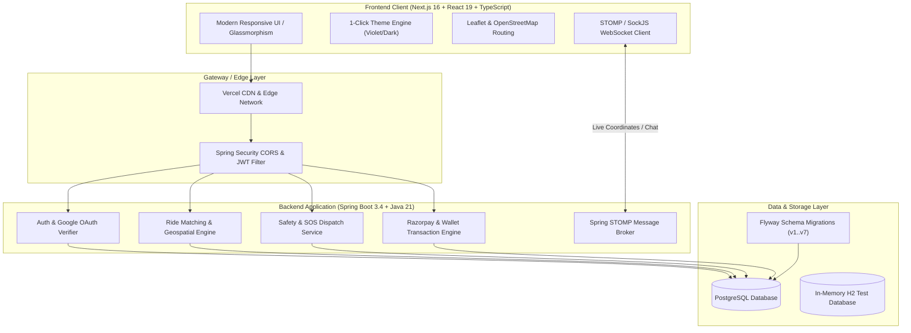

<div align="center">

# 🚗 Commuto — Smart Urban Ride Sharing & Carpooling Platform

[](https://commuto-iota.vercel.app/)
[](https://github.com/ananyajain327/Commuto/actions)
[](https://opensource.org/licenses/MIT)

<br/>

[](https://nextjs.org/)
[](https://react.dev/)
[](https://www.typescriptlang.org/)
[](https://tailwindcss.com/)
[](https://spring.io/projects/spring-boot)
[](https://openjdk.org/)
[](https://www.postgresql.org/)
[](https://flywaydb.org/)
[](https://spring.io/guides/gs/messaging-stomp-websocket/)

<p align="center">
  <b>Share the Ride. Split the Fare. Travel Smarter.</b>
  <br/>
  Commuto is a full-stack, real-time carpooling and smart mobility platform engineered to match passengers and drivers along shared routes, minimize urban traffic congestion, lower commute expenses, and elevate passenger safety.
</p>

[Explore Live Demo](https://commuto-iota.vercel.app/) • [Report Bug](https://github.com/ananyajain327/Commuto/issues) • [Request Feature](https://github.com/ananyajain327/Commuto/issues)

</div>

---

## 🌟 Key Highlights

- 🚀 **Live Production Deployment**: Frontend live on [Vercel](https://commuto-iota.vercel.app/) with automated continuous integration.
- 🧠 **Smart Route Matching**: Algorithmic scoring evaluating route proximity, waypoint alignment, departure timing, and driver rating.
- 📍 **Real-Time Tracking & Interactive Routing**: Live location updates and route rendering powered by OpenStreetMap & Leaflet.
- 🛡️ **Zero-Compromise Safety Ecosystem**: Dedicated Safety Center with 1-click Emergency SOS broadcast with live coordinates to designated emergency contacts.
- 👩 **Women-Only Commute Mode**: Dedicated filter allowing women drivers and passengers to commute exclusively with verified women.
- 💳 **Integrated Digital Wallet & Payments**: Razorpay checkout integration, real-time balance replenishment, and instant fare deduction.
- 💬 **Live In-Ride Chat**: Real-time messaging powered by Spring WebSockets & STOMP protocol.
- 🎨 **Modern Glassmorphic Design System**: 1-Click Dark/Light theme toggle featuring a bespoke **Electric Violet & Neon Obsidian** dark palette.
- 🔐 **Enterprise Security**: Cryptographically verified Google OAuth tokens (`GoogleIdTokenVerifier`), stateless JWT authentication, and fine-grained Role-Based Access Control (RBAC).

---

## 🏗️ Architecture & System Design



---

## 🚀 Core Features Deep Dive

### 1. 🚗 Dynamic Ride Publishing & Custom Requests
- **Drivers** publish rides specifying start location, destination, departure time, available seats, fare per seat, vehicle details, and women-only restrictions.
- **Passengers** can search scheduled rides with live filters or broadcast **Custom Ride Requests** with preferred pickup/drop points and seat budgets to nearby drivers.

### 2. 📍 Real-Time Location Tracking & Route Map
- Visual route mapping using OpenStreetMap and Leaflet.
- Live driver coordinates broadcasting via WebSockets during active rides.
- Interactive pickup waypoint markers and estimated arrival timing.

### 3. 🛡️ Safety Center & Emergency SOS System
- Add and manage primary & secondary emergency contacts.
- Immediate 1-click **SOS Panic Trigger** that captures GPS coordinates and dispatches automated alerts to emergency contacts and admin safety monitors.
- Complete safety audit logs and resolution workflows.

### 4. 💳 In-App Wallet & Razorpay Payment Gateway
- Digital wallet system with real-time balance tracking.
- Secure UPI, Net Banking, and Card checkout via Razorpay order creation and signature verification.
- Automatic transaction history categorization (Credit/Debit/Refund).

### 5. 💬 Real-Time Ride Chat
- STOMP-over-WebSocket live chatrooms scoped to individual ride IDs.
- Instant communication between matched passengers and drivers before and during the commute.

### 6. ⭐ Driver KYC Verification & Ratings
- Driver license and vehicle document submission flow.
- Admin dashboard to review, approve, or reject driver credentials.
- 5-star mutual rating system with reviews.

---

## 🛠️ Tech Stack

| Domain | Technology / Library | Purpose |
| :--- | :--- | :--- |
| **Frontend Framework** | **Next.js 16 (App Router)** | Modern SSR, Static Site Generation & Dynamic Routing |
| **UI Library** | **React 19** | Component-driven declarative UI |
| **Language** | **TypeScript 5** | Strict end-to-end static type safety |
| **Styling** | **Tailwind CSS v4** | Utility-first responsive design tokens |
| **Theme System** | **Custom CSS Variables** | 1-Click Dark/Light Mode (Electric Violet & Obsidian) |
| **Maps & Routing** | **Leaflet & React-Leaflet** | Interactive maps, markers, and path rendering |
| **Backend Framework** | **Spring Boot 3.4** | Enterprise Java microservices framework |
| **Java Platform** | **Java 21 (LTS)** | Modern language features, records, and virtual threads |
| **Database** | **PostgreSQL 16** | Relational data persistence with ACID compliance |
| **Migrations** | **Flyway DB** | Version-controlled, automated SQL migrations |
| **Security** | **Spring Security 6 + JWT** | Stateless authentication & Role-Based Access Control |
| **OAuth 2.0** | **Google API Client** | Cryptographic ID token verification |
| **Real-Time** | **Spring STOMP / WebSockets** | Bi-directional messaging and live location broadcasting |
| **Payments** | **Razorpay Java SDK** | Payment orders, signature verification & webhooks |
| **Testing** | **JUnit 5, Mockito & H2** | Automated unit & end-to-end integration tests |
| **Deployment** | **Vercel & Docker Compose** | Multi-container cloud deployment & edge CDN |

---

## 📂 Project Structure

```
Commuto/
├── .github/
│   ├── workflows/ci.yml           # Automated CI workflow (Lint, Types, Build, Tests)
│   ├── ISSUE_TEMPLATE/            # Bug report & Feature request templates
│   └── pull_request_template.md   # Standard PR guidelines template
├── backend/                       # Spring Boot 3.4 (Java 21) REST & WebSocket API
│   ├── src/main/java/Commuto/Backend/
│   │   ├── config/                # Security, CORS, WebSocket & Cloudinary config
│   │   ├── controller/            # REST API endpoints (Auth, Rides, Safety, Wallet, etc.)
│   │   ├── dto/                   # Data Transfer Objects & Request/Response records
│   │   ├── entity/                # JPA Database Entities (User, Ride, RideRequest, etc.)
│   │   ├── repository/            # Spring Data JPA Repositories
│   │   └── service/               # Core business logic, Google Auth verifier & calculations
│   ├── src/main/resources/
│   │   ├── db/migration/          # Flyway SQL migrations (V1 through V7)
│   │   └── application.properties # Spring configuration & profile bindings
│   └── pom.xml                    # Maven dependency management
├── frontend/                      # Next.js 16 (React 19, TypeScript, Tailwind v4)
│   ├── app/                       # App Router pages (35+ fully-featured routes)
│   │   ├── admin/                 # Admin oversight & verification dashboards
│   │   ├── booking/               # Confirmation, boarding passes & receipts
│   │   ├── driver/                # Driver dashboards, analytics & KYC verification
│   │   ├── rides/                 # Search, create, details, tracking & live map
│   │   ├── safety/                # Safety Center, SOS alerts & emergency contacts
│   │   ├── wallet/                # Digital wallet balance & Razorpay top-up
│   │   ├── globals.css            # Violet Obsidian design system & dark tokens
│   │   └── layout.tsx             # Root layout with responsive navigation
│   ├── components/                # Modular UI widgets (ThemeToggle, Maps, Chat, etc.)
│   ├── lib/                       # API helpers & client-side notification service
│   └── package.json               # Frontend dependencies & scripts
├── compose.yaml                   # Production-ready Docker Compose configuration
├── DEPLOYMENT.md                  # Comprehensive deployment guide (Render/Railway/Vercel)
├── CONTRIBUTING.md                # Open source contribution guidelines
├── SECURITY.md                    # Security policy & responsible disclosure
└── LICENSE                        # MIT License
```

---

## ⚡ Getting Started Locally

### Prerequisites
- **Node.js** (v20 or v22 LTS) & **npm**
- **Java Development Kit (JDK 21)**
- **PostgreSQL 16** (or Docker)

---

### 1. Clone the Repository
```bash
git clone https://github.com/ananyajain327/Commuto.git
cd Commuto
```

---

### 2. Backend Setup

1. Configure your local database properties in `backend/src/main/resources/application.properties` or set environment variables:
   ```env
   SPRING_DATASOURCE_URL=jdbc:postgresql://localhost:5432/commuto_db
   SPRING_DATASOURCE_USERNAME=postgres
   SPRING_DATASOURCE_PASSWORD=your_password
   JWT_SECRET=your_super_secret_jwt_key_at_least_32_characters
   ```
2. Run database migrations and launch the Spring Boot server:
   ```bash
   cd backend
   ./mvnw spring-boot:run
   ```
   *The backend API will start on `http://localhost:8080`.*

3. Run backend test suite:
   ```bash
   ./mvnw test
   ```

---

### 3. Frontend Setup

1. Navigate to the frontend directory and install dependencies:
   ```bash
   cd frontend
   npm install
   ```
2. Create `.env.local` in `frontend/`:
   ```env
   NEXT_PUBLIC_API_URL=http://localhost:8080
   NEXT_PUBLIC_GOOGLE_CLIENT_ID=your_google_client_id.apps.googleusercontent.com
   NEXT_PUBLIC_RAZORPAY_KEY_ID=your_razorpay_key_id
   ```
3. Start the Next.js development server:
   ```bash
   npm run dev
   ```
   *Open [http://localhost:3000](http://localhost:3000) in your browser.*

---

### 4. Running with Docker Compose (Full Stack)
```bash
docker compose up --build -d
```

---

## 📡 Key API Endpoints

| Method | Endpoint | Description | Role / Auth |
| :--- | :--- | :--- | :--- |
| `POST` | `/api/auth/register` | Register new user account | Public |
| `POST` | `/api/auth/login` | Authenticate with email & password | Public |
| `POST` | `/api/auth/google` | Cryptographic Google OAuth authentication | Public |
| `GET` | `/api/rides/search` | Search rides by origin, destination & date | Authenticated |
| `POST` | `/api/rides` | Publish a new scheduled ride | `DRIVER` |
| `POST` | `/api/ride-requests` | Request seats for a ride | `PASSENGER` |
| `POST` | `/api/custom-ride-requests` | Broadcast custom travel request | `PASSENGER` |
| `POST` | `/api/safety/sos` | Trigger emergency SOS panic broadcast | Authenticated |
| `GET` | `/api/wallet/balance` | Fetch user wallet balance | Authenticated |
| `POST` | `/api/wallet/topup/create-order` | Initialize Razorpay checkout order | Authenticated |
| `WS` | `/ws` | STOMP WebSocket handshake for chat & tracking | Authenticated |

---

## 🧪 Quality Assurance & CI/CD

Commuto maintains strict code quality and continuous integration standards:
- **Linting**: ESLint with strict hook rules (`0 errors, 0 warnings`).
- **Type Safety**: TypeScript strict mode (`tsc --noEmit` pass with zero errors).
- **Backend Testing**: 42 automated unit and integration tests covering security, JWT, ride calculations, rating mechanisms, and safety dispatch.
- **GitHub Actions**: Automated multi-job CI pipeline running on every push and pull request.

---

## 🤝 Contributing

Contributions are warmly welcome! Please check [CONTRIBUTING.md](CONTRIBUTING.md) for step-by-step instructions on branching, commit conventions, and pull request workflow.

---

## 📄 License

This project is licensed under the [MIT License](LICENSE) — see the LICENSE file for details.

<div align="center">
  <sub>Built with ❤️ by <a href="https://github.com/ananyajain327">Ananya Jain</a> and contributors.</sub>
</div>
